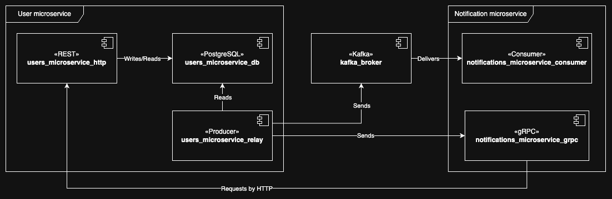

# Notifications microservice

This project provides an API for manage operations related to notifications (ex. send notifications)



As the diagram shows, this project is compiled in two parts:
1. `notifications-grpc`  It is the binary in charge of manage the gRPC requests related with send notifications (gRPC server)
2. `notifications-consumer` It is the binary in charge of read the messages to log notifications (kafka consumer)

### Getting started
[See the required environment variables](.env.example)

[See the API specification]()

### How to use from source
Follow the instructions below to compile and locally.
(All compiled binaries will put in the `build` directory)

> 💡 These binaries require external dependencies to run (a PostgreSQL server with a specific database schema)
> so should be run using docker compose. [See documentation](../README.md)
###### User service (sender)
```shell
make grpc
./build/notifications-grpc
```
###### Message relay
```shell
make consumer
./build/notifications-consumer
```

### Architecture decisions
###### Go project layout standard
I decided to follow the [Go project layout standard](https://github.com/golang-standards/project-layout).
###### Package tree
I built the package tree following the concepts of the [hexagonal architecture pattern](https://alistair.cockburn.us/hexagonal-architecture/).
```
.
├── cmd
├── internal
│   ├── app
│   │   ├── business (Use cases, business rules, data models and ports)
│   │   ├── input    (Everything related to "drive" adapters)
│   │   └── output   (Everything related to "driven" adapters)
│   └── container (DI container)
└── pkg (Public and global code, potencially libraries)
```
###### Compile only what is required
According to the theory of hexagonal architecture, it is possible to have *n* adapters for different external signals (http, gRPC, command line, kafka, serverless).

So I decided to compile a binary to handle each signal. [See why this decision](../docs/splitting.md)